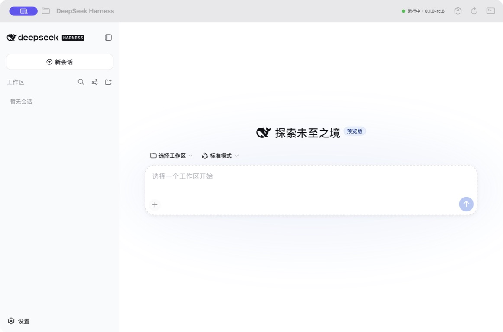

<p align="center">
  
</p>

<h1 align="center">DeepSeek Harness GUI for macOS</h1>

<p align="center">
  An unofficial native macOS shell for the localhost Web UI of DeepSeek Harness.
</p>

<p align="center">
  <strong>English</strong> · <a href="README.zh-CN.md">简体中文</a> ·
  <a href="https://github.com/CoralFlower325/Deepseek-Harness-GUI/releases/latest">Download</a>
</p>

<p align="center">
  <a href="https://github.com/CoralFlower325/Deepseek-Harness-GUI/releases/latest"></a>
  
  
  
  <a href="LICENSE"></a>
</p>

> [!WARNING]
> The current DMG is an unsigned, unnotarized community preview. macOS may block
> its first launch. Read [Installing an unsigned build](#installing-an-unsigned-build)
> before downloading. This project is not affiliated with or endorsed by DeepSeek
> or LobeHub.

## Overview

DeepSeek Harness GUI wraps the official DeepSeek Harness localhost Web UI in a
native SwiftUI window. The app starts `dsh web` as a child process, discovers the
dynamic localhost address printed when the service is ready, and loads that URL
in `WKWebView`.

The downloadable DMG contains Node.js and npm, but no fixed Harness runtime. On
first launch, the app prefers an existing local `dsh`. If none is found, users
can locate an existing executable or confirm installation of the current npm
release into Application Support.

<p align="center">
  <a href="docs/images/app-preview.png">
    
  </a>
  <br />
  <sub>DeepSeek Harness GUI v0.2.1 using a locally discovered Harness. Click the image to view the full-resolution PNG.</sub>
</p>

## Highlights

- Native SwiftUI window with the complete Harness Web UI.
- Dynamic localhost port; no fixed-port conflict.
- Release DMG includes Node.js and npm without freezing a Harness version.
- Automatically discovers common local `dsh` installations, including packages
  downloaded through `npx`, and supports a user-selected executable path.
- First-run installer for users who do not already have Harness.
- Existing Harness profiles, sessions, model settings, and API keys remain in
  the standard `~/.dsh` directory.
- Runtime updates are downloaded independently of the macOS app.
- New runtimes become active only after they print a usable Web URL.
- One previous runtime is retained as an executable fallback.
- Selectable workspace, restart control, runtime manager, and process logs.

## Requirements

The current `v0.2.1` binary release supports:

- macOS 14 or later
- Apple Silicon (`arm64`)
- Internet access when calling model providers or downloading runtime updates

Intel Macs are not included in the current prebuilt DMG. The source can be built
on another Mac with a compatible Swift and Node.js toolchain.

## Download and install

1. Open the [latest GitHub Release](https://github.com/CoralFlower325/Deepseek-Harness-GUI/releases/latest).
2. Download `Deepseek-Harness-GUI-v0.2.1-arm64.dmg`.
3. Open the DMG.
4. Drag **DeepSeek Harness.app** into **Applications**.
5. Start the app and choose a workspace from the toolbar when needed.

The GitHub-generated **Source code** ZIP and TAR files are developer sources;
they do not contain the bundled Node.js/npm engine. End users should download
the DMG asset instead.

### Installing an unsigned build

The current community preview has no Apple Developer ID signature and has not
been notarized. Gatekeeper may display an unidentified-developer warning.

Try the standard macOS flow:

1. In Finder, Control-click **DeepSeek Harness.app** and choose **Open**.
2. If macOS still blocks it, open **System Settings → Privacy & Security**.
3. Find the message about DeepSeek Harness and choose **Open Anyway**.

Only continue if you intentionally downloaded the app from this repository.
The project does not ask users to disable Gatekeeper globally.

## Existing installations and user data

The app always uses the standard Harness home directory:

```text
~/.dsh/
```

This preserves settings created by the official CLI, including model profiles,
sessions, and API-key configuration. The Swift wrapper does not copy `~/.dsh`
into the application bundle, repository, or DMG.

Automatic mode checks a previously selected path, common Homebrew and user-level
locations, packages previously downloaded by `npx @deepseek-ai/dsh`, and the
app's inherited `PATH`. A discovered local executable is preferred over an
app-managed runtime. If automatic discovery misses an existing installation,
choose **Select dsh…** and point the app to the executable.

When no local or managed runtime exists, the first-run screen offers two setup
routes and a separate re-detection action:

1. select an already installed `dsh` executable;
2. confirm download and installation of the current npm release.

## Runtime management

Managed runtimes and version state are stored under:

```text
~/Library/Application Support/DeepSeekHarnessMac/
├── runtime-state.json
├── runtime-update.log
└── runtimes/<version>/
```

The app queries the npm registry for `@deepseek-ai/dsh`. A downloaded version is
first recorded as `pending`; it becomes `active` only after the process prints a
usable `dsh web: http://127.0.0.1:...` address. The former active version becomes
`previous`.

Local installations remain under Homebrew/npm or user control; the GUI never
overwrites them. It can still report an available npm version and download that
version as an App-managed alternative.

Available update policies:

- Ask before installing an available version (default)
- Download updates automatically
- Pin the current runtime

Runtime rollback only changes the executable version. It cannot guarantee that
an older preview runtime can read data already modified by a newer release.

## Architecture

```text
SwiftUI app
   ├── discovers or accepts a local dsh path
   ├── otherwise installs @deepseek-ai/dsh with bundled Node.js/npm
   ├── launches dsh web --host 127.0.0.1 --port 0
   ├── reads the ready URL from process output
   └── loads the localhost UI in WKWebView

~/.dsh
   └── official Harness settings, profiles, API keys, and sessions

~/Library/Application Support/DeepSeekHarnessMac
   └── app-managed runtime versions and update state
```

The Web service binds to `127.0.0.1`; this wrapper does not expose it as a LAN
server.

## Build from source

Prerequisites:

- macOS with a Swift 6-compatible toolchain
- Node.js and npm
- `hdiutil`, included with macOS

Prepare the bundled Node.js/npm engine and build the app:

```bash
git clone https://github.com/CoralFlower325/Deepseek-Harness-GUI.git
cd Deepseek-Harness-GUI
./scripts/prepare-engine.sh
./scripts/build-app.sh
./scripts/package-dmg.sh
```

Outputs are placed in `dist/`. Generated Node.js, npm, runtime, app, and DMG
files are ignored by Git.

The included scripts intentionally produce an unsigned app. A maintainer who
wants a trusted distribution must add Developer ID signing and Apple
notarization in their own release environment.

## Known limitations

- The current prebuilt release is Apple Silicon only.
- The current release is unsigned and unnotarized.
- If no local or previously managed runtime exists, initial setup requires
  access to the npm registry.
- Local Harness installations are detected and launched but not modified or
  upgraded by the GUI.
- Harness is evolving quickly; changes to its CLI ready message or Web behavior
  may require an app update.
- The DMG still includes Node.js and npm so it can install Harness without a
  separate developer environment.
- App updates and Harness runtime updates are separate processes.

## Repository layout

```text
Sources/DeepSeekHarnessMac/   Swift application source
Resources/Info.plist          macOS bundle metadata
Resources/AppIcon.icns        macOS application icon
Resources/AppIcon-source.png  source artwork used for the icon
scripts/prepare-engine.sh     prepares the bundled Node.js/npm engine
scripts/build-app.sh          builds the unsigned app bundle
scripts/package-dmg.sh        creates the drag-to-Applications DMG
```

## Contributing

Bug reports and focused pull requests are welcome. Before contributing, read
[CONTRIBUTING.md](CONTRIBUTING.md). Maintainers can find the unsigned release
procedure in [docs/RELEASING.md](docs/RELEASING.md).

When reporting a problem, include the macOS version, CPU architecture, app
version, Harness runtime version, reproducible steps, and only the relevant log
lines. Never post API keys or the contents of `~/.dsh`.

## Credits and license

- [DeepSeek Harness](https://github.com/deepseek-ai/deepseek-harness) provides
  the CLI and Web UI embedded by Release builds.
- The application icon was identified by the contributor as coming from the
  [LobeHub](https://github.com/lobehub/lobehub) ecosystem. LobeHub publishes its
  brand icon collection through [Lobe Icons](https://github.com/lobehub/lobe-icons).

The original Swift wrapper and build scripts are available under the MIT
License. Bundled software and artwork retain their own licenses and brand rights.
See [LICENSE](LICENSE) and [THIRD_PARTY_NOTICES.md](THIRD_PARTY_NOTICES.md).
